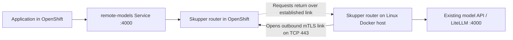

# Skupper model routing

Ansible automation that exposes an existing model API on a private Linux host as a service inside OpenShift. The remote host establishes an outbound mTLS link to the cluster on TCP 443. Applications in the cluster send requests back through that link.

Extracted from a DGX Spark setup using vLLM and LiteLLM. The endpoint can be GLM, Qwen, another model server, or a proxy: this repository forwards TCP traffic and does not select models. Model serving and API authentication remain the endpoint's responsibility.



## Prerequisites

- Control machine: Python 3, Ansible Core 2.18+, `oc`, and upstream **Skupper CLI 2.2.1** on `PATH`.
- Remote machine: Linux, Python 3, Docker accessible to the SSH user, and **Skupper CLI 2.2.1**. DGX Spark uses the Linux arm64 CLI; most control machines use amd64. Set `remote_skupper_bin` to an absolute path if SSH's noninteractive `PATH` does not include it.
- SSH access from the control machine to the remote host. Your laptop may need VPN access to run Ansible. Configure SSH keys and verify the host key first.
- A running model API reachable from the remote host at `model_host:model_port`. The extracted Linux Docker setup uses host networking, so `127.0.0.1` can address a model server on that machine.
- An authenticated `oc` session, an existing **dedicated namespace**, and the Skupper 2.2.1 CRDs installed by a cluster administrator.
- Permission to read the CRDs and manage namespaced Sites, Listeners, AccessGrants, pods, and the controller's RBAC/deployment when `manage_controller: true`.
- Remote-host outbound connectivity to the cluster's Skupper OpenShift Routes on TCP 443, including DNS resolution. The link uses TLS passthrough; an HTTPS-only proxy or TLS interception can prevent it working. The remote host also needs access to its container registry; cluster nodes need access to the controller, router, and probe images.

Get matching CLI binaries from the [Skupper 2.2.1 release](https://github.com/skupperproject/skupper/releases/tag/2.2.1). See the [installation documentation](https://skupper.io/docs/install/index.html) and [local-system configuration documentation](https://skupper.io/docs/system-cli/site-configuration.html).

A cluster administrator can install the pinned CRDs once:

```bash
oc apply -f https://github.com/skupperproject/skupper/releases/download/2.2.1/skupper-crds.yaml
```

The playbook installs the included namespace-scoped controller by default. If a controller already watches the namespace, use `manage_controller: false`; the administrator must ensure its version and grant/Route configuration are compatible. Do not run two controllers watching the same namespace. The included controller uses `quay.io/skupper/controller:2.2.1`, `quay.io/skupper/kube-adaptor:2.2.1`, and `quay.io/skupper/skupper-router:3.5.1` from the original working setup.

## Configure and connect

```bash
git clone git@github.com:IsaiahStapleton/skupper-model-routing.git
cd skupper-model-routing/ansible
cp inventory.example.ini inventory.ini
cp config.example.yml config.yml
```

Edit `inventory.ini` with exactly one remote SSH host under `model_hosts`. You can use an SSH config alias as `ansible_host`.

Edit `config.yml`:

| Setting | Meaning |
| --- | --- |
| `cluster_api` | Exact output of `oc whoami --show-server`; checked before changes |
| `cluster_namespace` | Dedicated OpenShift namespace for this connection |
| `model_host`, `model_port` | Existing endpoint reachable from the Docker host |
| `service_name`, `service_port` | Service created inside OpenShift |
| `probe_path` | HTTP probe path; `/v1/models` or LiteLLM's `/health/liveliness` |
| `remote_namespace` | Dedicated Skupper namespace on the Docker host; separate from other sites |
| `manage_controller` | Install/remove the included namespaced controller, or use an administrator-managed controller |
| `remote_skupper_bin` | Remote CLI path; absolute paths work with noninteractive SSH |

For example, an existing GLM server on port 8000 needs `model_port: 8000`; the in-cluster service can still listen on `service_port: 4000`. Model names are specified in API requests, not in Skupper.

Create the chosen OpenShift project if necessary, then run setup from `ansible/`:

```bash
oc new-project model-routing
ansible-playbook up.yml
```

`up.yml` checks both targets and the model TCP port, installs the cluster site/listener, starts the Docker site, issues and redeems a short-lived link token, reloads the router, and tests connectivity from a temporary cluster pod.

For the example configuration, applications use:

```text
http://remote-models.model-routing.svc.cluster.local:4000/v1
```

Supply the API key required by your model server or LiteLLM through the application's normal secret configuration. Skupper transports the request unchanged; it does not inject, replace, or verify model API keys. Your original OpenClaw sidecar's key substitution is application-specific and is outside these playbooks.

## Verify

```bash
cd ansible
ansible-playbook verify.yml
oc get site,listener -n model-routing
oc get routes -n model-routing
```

Verification waits for at least two sites in the network and runs an HTTP request from a temporary pod to the model service. HTTP **200, 401, or 403** counts as a reachable HTTP endpoint: a 401/403 means authentication or authorization still needs to be configured for real use. This is a connectivity check; it does not validate authenticated inference, model selection, output quality, or streaming. Configure a different `probe_image` if your cluster uses a registry mirror.

The link is initiated and stored on the remote side. An empty `oc get links` on the cluster is therefore not, by itself, a failure.

## Reruns, credentials, and teardown

- `up.yml` refreshes the link token and reloads the remote router on each run. Existing requests may be interrupted; it is repeatable but not a zero-change reconciliation.
- Token redemption is limited to one use within one hour. This window governs enrollment, not the lifetime of an established link. Redeemed link certificates remain in the remote Skupper namespace so the router can reconnect.
- Temporary token files are removed on success and ordinary task failure. An interrupted Ansible process or unreachable remote host can leave a temporary token file; clean it up after restoring access. Never commit or share tokens, link Secrets, kubeconfigs, or Skupper state.
- The remote state directory has an ownership marker tied to the cluster API and namespace. The playbook refuses to take over existing unmarked state. Use this repository's original configuration to tear down before changing the cluster target, service name, or site names.
- This project owns the dedicated remote namespace. Do not add unrelated links, Secrets, or connectors to it.

To remove the connection:

```bash
cd ansible
ansible-playbook down.yml
```

Teardown checks the active cluster and ownership before changes, stops the dedicated remote router, removes its local Skupper namespace, and deletes the named cluster Site and Listener. It removes the bundled controller only when `manage_controller: true`. Keep that setting consistent between setup and teardown. It leaves the OpenShift namespace, cluster CRDs, Docker installation, model servers, model weights, API keys, and other remote Skupper namespaces in place. Site-owned resources are left to Skupper/Kubernetes owner cleanup; teardown does not run namespace-wide `delete --all` commands.

## VPN sessions and network requirements

The inference path relies on outbound connectivity from the remote machine to OpenShift. If that machine is already on the private corporate network and can reach the cluster directly, your laptop's VPN session is only needed for administration and can expire without taking down the model link.

If the remote machine itself needs an active VPN session to reach the cluster, that VPN's reauthentication policy still applies. Skupper keepalives do not override VPN session limits. Corporate routing, egress rules, TLS handling, and firewall policy still apply.

For troubleshooting, check the endpoint locally on the remote host, then check Skupper site status and logs. Inspect the generated cluster Routes and confirm their hostnames resolve and are reachable from the remote machine. If the probe fails, Ansible prints its logs and removes the temporary pod. Pod admission or image-pull failures are separate from link connectivity.

## Local validation

```bash
cd ansible
# Requires local example copies of config.yml and inventory.ini.
ansible-playbook --syntax-check up.yml
ansible-playbook --syntax-check verify.yml
ansible-playbook --syntax-check down.yml
cd ..
python3 -m unittest discover -s tests -v
```

Tests require Ansible, Jinja2, and PyYAML. They run the real playbooks in a temporary directory with local SSH substitutes and fake `oc`, `skupper`, and `docker` commands. They cover setup/rerun/verification/teardown, rejection of the wrong cluster and unrelated state, token cleanup after a failed redemption, and probe cleanup after failure. They do not contact a real cluster, Docker daemon, or DGX. Check mode is intentionally rejected because CLI-driven site creation and token exchange cannot meaningfully simulate deployment.

The extracted playbooks have been checked locally; they have not yet been deployed end to end against a real cluster. The original DGX setup is the starting point, and the first live run should use the dedicated namespaces described above.

## Provenance and support

Extracted and generalized from the Ansible networking tasks in `spark-model-routing`, originally used to connect an on-premises DGX Spark to OpenShift. Model provisioning, benchmark results, personal hostnames, vaults, and API keys are excluded.

This repository uses **upstream Skupper**. Red Hat's [Service Interconnect product](https://access.redhat.com/products/red-hat-service-interconnect/) is based on Skupper; this repository is not a Red Hat supported product or a claim of support for a particular deployment.
